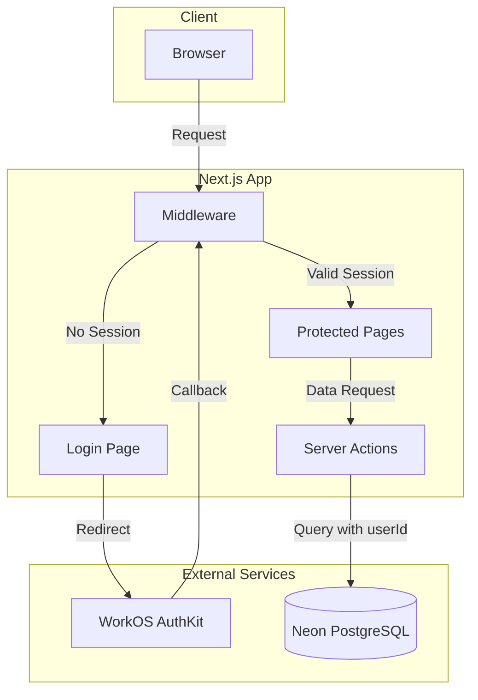
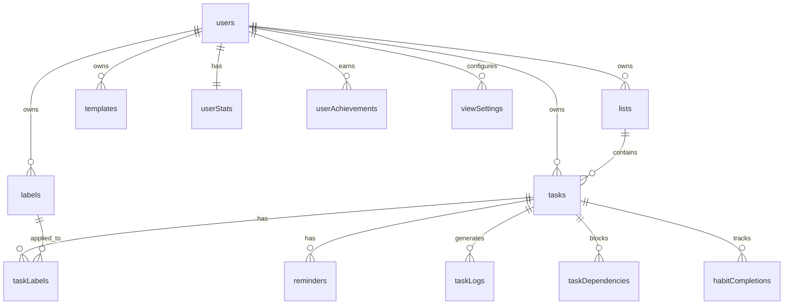

# Design Document: Multi-User Authentication

## Overview

This design document outlines the implementation of multi-user support and authentication for Todo Gemini using WorkOS AuthKit. The system will transform the application from a single-user to a multi-tenant architecture where each user has isolated data.

### Key Design Decisions

1. **WorkOS AuthKit** - Using the `@workos-inc/authkit-nextjs` package for seamless Next.js App Router integration
2. **Middleware-based Auth** - Using Next.js middleware for route protection and session management
3. **User ID Propagation** - All server actions will receive the authenticated user ID from the session
4. **Database Migration** - Adding `userId` columns to existing tables with foreign key constraints

## Architecture



## Components and Interfaces

### 1. Authentication Middleware (`src/middleware.ts`)

The middleware intercepts all requests and handles:
- Session validation via WorkOS
- Automatic session refresh
- Redirect to login for unauthenticated users
- Protection of all routes except public paths

```typescript
// Middleware configuration
export const config = {
  matcher: [
    '/((?!api/auth|_next/static|_next/image|favicon.ico|manifest.json|sw.js|icon-.*\\.png).*)',
  ],
};
```

### 2. Auth Callback Route (`src/app/auth/callback/route.ts`)

Handles the OAuth callback from WorkOS:
- Exchanges authorization code for session
- Creates/updates local user record
- Sets secure session cookie
- Redirects to application

### 3. Login Page (`src/app/login/page.tsx`)

Public page displaying:
- Sign-in button (redirects to WorkOS)
- Sign-up link (redirects to WorkOS sign-up)
- Application branding

### 4. Auth Utilities (`src/lib/auth.ts`)

Helper functions for authentication:
- `getCurrentUser()` - Gets authenticated user from session
- `requireAuth()` - Throws if not authenticated (for server actions)
- `signOut()` - Server action to clear session

### 5. User Profile Component (`src/components/layout/UserProfile.tsx`)

Displays in sidebar:
- User avatar (from WorkOS or initials)
- User name/email
- Sign-out button

### 6. Database Schema Updates

New `users` table and `userId` foreign keys on existing tables.

## Data Models

### Users Table (New)

```typescript
export const users = pgTable("users", {
  id: text("id").primaryKey(), // WorkOS user ID
  email: text("email").notNull(),
  firstName: text("first_name"),
  lastName: text("last_name"),
  avatarUrl: text("avatar_url"),
  createdAt: timestamp("created_at").notNull().defaultNow(),
  updatedAt: timestamp("updated_at").notNull().defaultNow(),
});
```

### Modified Tables

All user-owned tables will add:

```typescript
userId: text("user_id")
  .notNull()
  .references(() => users.id, { onDelete: "cascade" }),
```

Tables to modify:
- `tasks` - Add userId, index
- `lists` - Add userId, index  
- `labels` - Add userId, index
- `templates` - Add userId, index
- `userStats` - Change from singleton to per-user (add userId as PK)
- `userAchievements` - Add userId to composite PK
- `viewSettings` - Add userId to composite PK
- `taskLogs` - Add userId, index

### Entity Relationship Diagram



## Correctness Properties

*A property is a characteristic or behavior that should hold true across all valid executions of a system-essentially, a formal statement about what the system should do. Properties serve as the bridge between human-readable specifications and machine-verifiable correctness guarantees.*

### Property 1: User Creation Idempotence

*For any* WorkOS user ID, calling the user creation/sync function multiple times SHALL result in exactly one user record in the database with that ID.

**Validates: Requirements 1.3**

### Property 2: Default Data Initialization

*For any* newly created user, the user SHALL have exactly one list named "Inbox" and a userStats record with xp=0, level=1, currentStreak=0.

**Validates: Requirements 1.4, 5.5**

### Property 3: Resource Ownership on Create

*For any* resource (task, list, label, template, view setting) created by user A, that resource SHALL have userId equal to user A's ID.

**Validates: Requirements 4.1, 4.3, 4.5, 6.1**

### Property 4: Query Data Isolation

*For any* two distinct users A and B, when user A queries any resource type (tasks, lists, labels, stats, achievements, view settings), the result set SHALL contain zero resources belonging to user B.

**Validates: Requirements 4.2, 4.4, 4.6, 5.2, 5.4, 6.2**

### Property 5: Update Isolation

*For any* state-changing operation (task completion, XP update, achievement unlock) performed by user A, only user A's data SHALL be modified and all other users' data SHALL remain unchanged.

**Validates: Requirements 5.1, 5.3**

### Property 6: Authorization Denial

*For any* resource owned by user A, when user B attempts to access or modify that resource via direct ID, the system SHALL return an authorization error and SHALL NOT return or modify the resource.

**Validates: Requirements 4.7**

### Property 7: Session Cookie Security

*For any* session cookie created by the authentication system, the cookie SHALL have httpOnly=true, secure=true (in production), and sameSite='lax'.

**Validates: Requirements 2.3, 7.1**

### Property 8: Valid Session Grants Access

*For any* request with a valid session cookie, the middleware SHALL allow access to protected routes and SHALL NOT redirect to the login page.

**Validates: Requirements 2.4**

### Property 9: API Unauthorized Response

*For any* API route request lacking valid authentication, the system SHALL return a 401 Unauthorized response and SHALL NOT return protected data.

**Validates: Requirements 7.3**

## Error Handling

### Authentication Errors

| Error Scenario | Handling |
|----------------|----------|
| No session cookie | Redirect to /login |
| Expired session | Attempt refresh, redirect to /login if fails |
| Invalid session | Clear cookie, redirect to /login |
| WorkOS API error | Log error, show generic error message |

### Authorization Errors

| Error Scenario | Handling |
|----------------|----------|
| Access to other user's resource | Return 403 Forbidden |
| Missing userId in request | Return 401 Unauthorized |
| Database constraint violation | Return 400 Bad Request |

### Error Response Format

```typescript
interface AuthError {
  code: 'UNAUTHORIZED' | 'FORBIDDEN' | 'SESSION_EXPIRED';
  message: string;
}
```

## Testing Strategy

### Dual Testing Approach

This implementation uses both unit tests and property-based tests:

1. **Unit Tests** - Verify specific examples and edge cases
2. **Property-Based Tests** - Verify universal properties across random inputs

### Property-Based Testing Framework

Using `fast-check` (already in devDependencies) for property-based testing.

### Test Categories

#### 1. Authentication Flow Tests (Unit)
- Login redirect for unauthenticated users
- Successful authentication callback
- Session refresh behavior
- Sign-out clears session

#### 2. Data Isolation Tests (Property-Based)
- User A cannot see User B's tasks
- User A cannot see User B's lists
- User A cannot see User B's labels
- User A cannot modify User B's data

#### 3. User Initialization Tests (Property-Based)
- New users get default Inbox list
- New users get initialized stats
- User creation is idempotent

#### 4. Authorization Tests (Unit + Property)
- Direct ID access returns 403 for wrong user
- All server actions validate userId
- API routes return 401 without auth

### Test Configuration

```typescript
// Property test configuration
fc.configureGlobal({
  numRuns: 100, // Minimum 100 iterations per property
  verbose: true,
});
```

### Test File Structure

```
src/
├── lib/
│   ├── auth.test.ts           # Auth utility tests
│   └── actions.test.ts        # Server action tests (updated)
├── components/
│   └── layout/
│       └── UserProfile.test.tsx
└── test/
    ├── setup.ts               # Updated with auth mocks
    └── properties/
        ├── data-isolation.property.test.ts
        ├── user-initialization.property.test.ts
        └── authorization.property.test.ts
```

## Environment Variables

```bash
# WorkOS Configuration
WORKOS_API_KEY=sk_...           # WorkOS API key
WORKOS_CLIENT_ID=client_...     # WorkOS client ID
WORKOS_COOKIE_PASSWORD=...      # 32+ char password for cookie encryption
WORKOS_REDIRECT_URI=http://localhost:3000/auth/callback

# Existing
DATABASE_URL=postgresql://...
```

## Migration Strategy

1. **Schema Migration** - Add new columns with nullable userId initially
2. **Data Migration** - For existing single-user data, assign to a default/admin user
3. **Code Deployment** - Deploy auth-aware code
4. **Constraint Enforcement** - Make userId NOT NULL after migration
