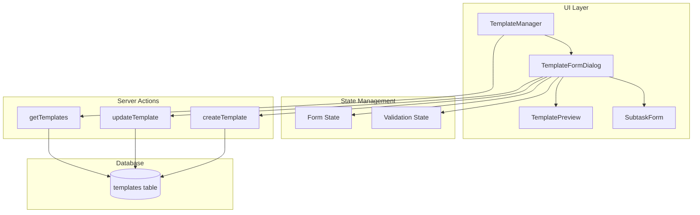

# Design Document: Template Form Interface

## Overview

This design replaces the current JSON-based template creation interface with an intuitive form-based interface. The new interface allows users to create and edit task templates using standard form controls (inputs, dropdowns, buttons) without requiring any JSON knowledge.

The implementation follows the existing patterns in the codebase, using React components with shadcn/ui primitives, server actions for data persistence, and the existing template database schema.

## Architecture

The template form interface consists of three main layers:

1. **UI Layer**: React components using shadcn/ui primitives for form controls
2. **State Management**: React useState hooks for form state and validation
3. **Data Layer**: Existing server actions for template CRUD operations



## Components and Interfaces

### TemplateFormDialog Component

The main form dialog component that handles template creation and editing.

```typescript
interface TemplateFormDialogProps {
  open: boolean;
  onOpenChange: (open: boolean) => void;
  template?: Template | null; // null for create, Template for edit
  userId: string;
  onSave: () => void;
}

interface TemplateFormData {
  name: string;
  title: string;
  description: string;
  priority: "none" | "low" | "medium" | "high";
  dueDateType: "none" | "today" | "tomorrow" | "next_week" | "custom";
  dueDateDays?: number; // For custom relative days
  energyLevel: "none" | "low" | "medium" | "high";
  context: "none" | "computer" | "phone" | "errands" | "meeting" | "home" | "anywhere";
  estimateMinutes?: number;
  subtasks: SubtaskFormData[];
}

interface SubtaskFormData {
  id: string; // Client-side ID for React key
  title: string;
  description: string;
}
```

### TemplatePreview Component

Displays a live preview of the template structure.

```typescript
interface TemplatePreviewProps {
  formData: TemplateFormData;
}
```

### SubtaskForm Component

Manages the list of subtasks within the template form.

```typescript
interface SubtaskFormProps {
  subtasks: SubtaskFormData[];
  onAdd: () => void;
  onRemove: (id: string) => void;
  onUpdate: (id: string, field: keyof SubtaskFormData, value: string) => void;
}
```

### Form Validation

```typescript
interface ValidationErrors {
  name?: string;
  title?: string;
  [key: string]: string | undefined;
}

function validateTemplateForm(data: TemplateFormData): ValidationErrors {
  const errors: ValidationErrors = {};
  
  if (!data.name.trim()) {
    errors.name = "Template name is required";
  }
  
  if (!data.title.trim()) {
    errors.title = "Task title is required";
  }
  
  return errors;
}
```

### Server Action Updates

A new `updateTemplate` server action is needed for editing:

```typescript
// In src/lib/actions/templates.ts
export async function updateTemplate(
  id: number,
  userId: string,
  name: string,
  content: string
): Promise<ActionResult<void>>
```

## Data Models

### Template Content JSON Schema

The form data is serialized to JSON for storage. The schema matches the existing template content format:

```typescript
interface TemplateContent {
  title: string;
  description?: string;
  priority?: "none" | "low" | "medium" | "high";
  dueDate?: string; // Variable like "{date}" or "{tomorrow}" or ISO date
  energyLevel?: "low" | "medium" | "high";
  context?: "computer" | "phone" | "errands" | "meeting" | "home" | "anywhere";
  estimateMinutes?: number;
  subtasks?: Array<{
    title: string;
    description?: string;
  }>;
}
```

### Form to JSON Serialization

```typescript
function serializeFormToJson(data: TemplateFormData): string {
  const content: TemplateContent = {
    title: data.title,
  };
  
  if (data.description) content.description = data.description;
  if (data.priority !== "none") content.priority = data.priority;
  if (data.energyLevel !== "none") content.energyLevel = data.energyLevel;
  if (data.context !== "none") content.context = data.context;
  if (data.estimateMinutes) content.estimateMinutes = data.estimateMinutes;
  
  // Handle due date type
  switch (data.dueDateType) {
    case "today":
      content.dueDate = "{date}";
      break;
    case "tomorrow":
      content.dueDate = "{tomorrow}";
      break;
    case "next_week":
      content.dueDate = "{next_week}";
      break;
    case "custom":
      if (data.dueDateDays) {
        // Store as relative days for custom handling
        content.dueDate = `+${data.dueDateDays}d`;
      }
      break;
  }
  
  if (data.subtasks.length > 0) {
    content.subtasks = data.subtasks
      .filter(s => s.title.trim())
      .map(s => ({
        title: s.title,
        ...(s.description && { description: s.description }),
      }));
  }
  
  return JSON.stringify(content);
}
```

### JSON to Form Deserialization

```typescript
function deserializeJsonToForm(json: string): TemplateFormData | null {
  try {
    const content = JSON.parse(json) as TemplateContent;
    
    let dueDateType: TemplateFormData["dueDateType"] = "none";
    let dueDateDays: number | undefined;
    
    if (content.dueDate) {
      if (content.dueDate === "{date}") dueDateType = "today";
      else if (content.dueDate === "{tomorrow}") dueDateType = "tomorrow";
      else if (content.dueDate === "{next_week}") dueDateType = "next_week";
      else if (content.dueDate.startsWith("+") && content.dueDate.endsWith("d")) {
        dueDateType = "custom";
        dueDateDays = parseInt(content.dueDate.slice(1, -1), 10);
      }
    }
    
    return {
      name: "", // Name comes from template record, not content
      title: content.title,
      description: content.description || "",
      priority: content.priority || "none",
      dueDateType,
      dueDateDays,
      energyLevel: content.energyLevel || "none",
      context: content.context || "none",
      estimateMinutes: content.estimateMinutes,
      subtasks: (content.subtasks || []).map((s, i) => ({
        id: `subtask-${i}`,
        title: s.title,
        description: s.description || "",
      })),
    };
  } catch {
    return null;
  }
}
```


## Correctness Properties

*A property is a characteristic or behavior that should hold true across all valid executions of a system—essentially, a formal statement about what the system should do. Properties serve as the bridge between human-readable specifications and machine-verifiable correctness guarantees.*

Based on the prework analysis, the following properties have been identified after consolidating redundant criteria:

### Property 1: Serialization Round-Trip

*For any* valid TemplateFormData (including subtasks and variable placeholders in title/description), serializing to JSON and then deserializing back to form data SHALL produce an equivalent TemplateFormData object.

This property validates that:
- All form fields are correctly serialized to JSON
- All subtasks are included in the serialized output (Requirement 2.6)
- Variable placeholders like `{date}`, `{tomorrow}`, `{next_week}` are preserved (Requirement 4.2)
- The deserialization correctly populates form fields (Requirement 3.2)

**Validates: Requirements 1.3, 2.6, 3.2, 4.2**

### Property 2: Name Validation

*For any* string input as template name, the validation function SHALL return an error if and only if the trimmed string is empty.

This ensures:
- Empty strings fail validation
- Whitespace-only strings fail validation
- Any non-empty trimmed string passes validation

**Validates: Requirements 1.2, 6.1**

### Property 3: Title Validation

*For any* string input as task title, the validation function SHALL return an error if and only if the trimmed string is empty.

This ensures:
- Empty strings fail validation
- Whitespace-only strings fail validation
- Any non-empty trimmed string passes validation

**Validates: Requirements 6.2**

## Error Handling

### Form Validation Errors

| Error Condition | User Feedback | Recovery Action |
|-----------------|---------------|-----------------|
| Empty template name | Red border on name field, "Template name is required" message | User enters a name |
| Empty task title | Red border on title field, "Task title is required" message | User enters a title |

### JSON Parsing Errors

| Error Condition | User Feedback | Recovery Action |
|-----------------|---------------|-----------------|
| Malformed JSON when editing | Toast notification "Could not parse template content", fallback to JSON editor | User can edit raw JSON or recreate template |
| Invalid template content structure | Toast notification with specific error | User corrects the issue |

### Server Action Errors

| Error Condition | User Feedback | Recovery Action |
|-----------------|---------------|-----------------|
| Database error on save | Toast notification "Failed to save template" | User retries |
| Template not found on edit | Toast notification "Template not found" | User refreshes template list |

## Testing Strategy

### Dual Testing Approach

This feature requires both unit tests and property-based tests:

1. **Unit Tests**: Verify specific UI behaviors, edge cases, and error conditions
2. **Property Tests**: Verify universal properties across all valid inputs

### Property-Based Testing Configuration

- **Library**: fast-check (already used in the codebase)
- **Minimum iterations**: 100 per property test
- **Tag format**: `Feature: template-form-interface, Property {number}: {property_text}`

### Unit Test Coverage

| Component | Test Cases |
|-----------|------------|
| TemplateFormDialog | Renders all form fields, handles submit, handles cancel |
| SubtaskForm | Add subtask, remove subtask, update subtask fields |
| TemplatePreview | Displays form data, shows subtasks, shows variables |
| Validation | Empty name error, empty title error, valid form passes |

### Property Test Coverage

| Property | Test Description |
|----------|------------------|
| Property 1 | Generate random valid form data, serialize, deserialize, compare |
| Property 2 | Generate random strings, validate name, check error presence matches empty check |
| Property 3 | Generate random strings, validate title, check error presence matches empty check |

### Test File Structure

```
src/components/tasks/
├── TemplateFormDialog.tsx
├── TemplateFormDialog.test.tsx      # Unit tests
├── TemplatePreview.tsx
├── SubtaskForm.tsx

src/lib/
├── template-form-utils.ts           # Serialization/deserialization/validation
├── template-form-utils.test.ts      # Unit tests

src/test/properties/
├── template-form.property.test.ts   # Property-based tests
```
